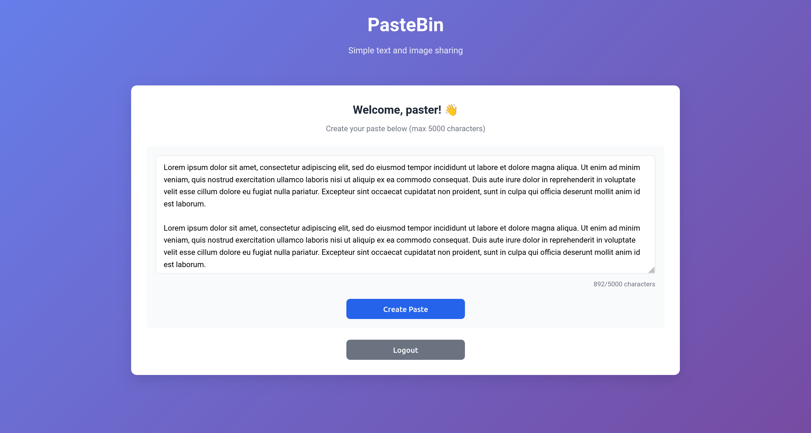
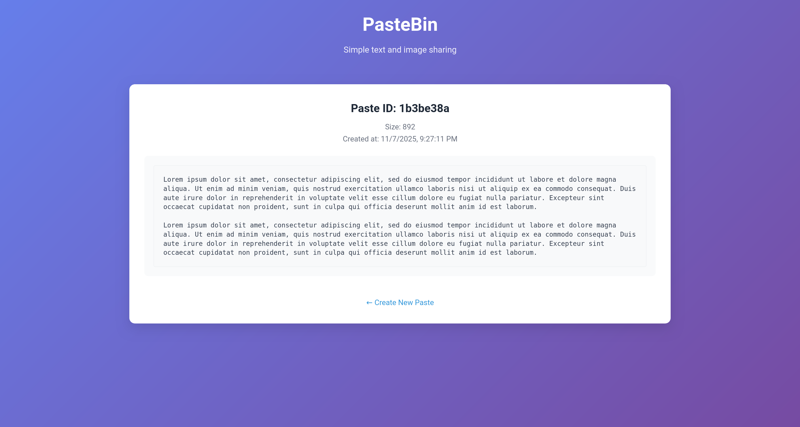
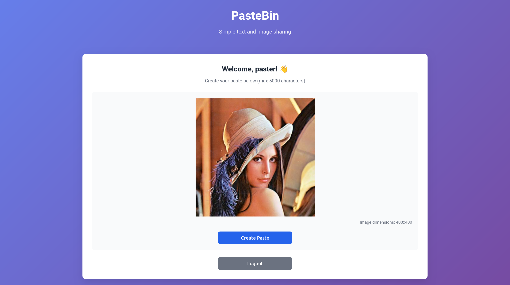
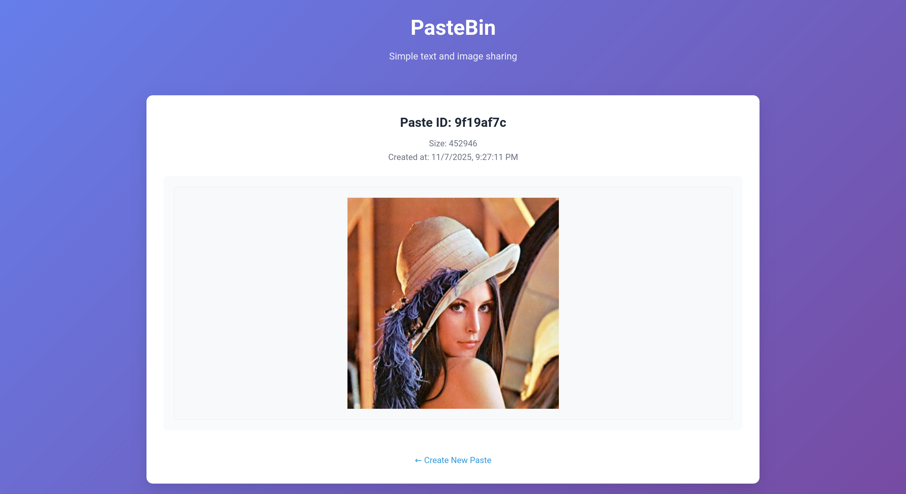

# Simple Pastebin Microservice

A minimal pastebin-like service with Python backend and simple web UI.

Allows sharing text snippets and images from clipboard with other users.

## Features

- Save text snippets (up to 5000 characters)
- Save image from clipboard
- Generate unique URL for each paste
- Simple web interface
- Only authenticated users can create pastes
- SQLite database

## Screenshots

Type    |            Create             |  View
:------:|:-----------------------------:|:-----------------------------:
Text    |  |  
Image   |  |  


## Docker (preferred)

1. Build docker image:

```bash
    docker build -t pastebin .
```
2. Run container

```bash
    docker run --name pastebin -v `pwd`/data:/data -p 80:5000/tcp -d pastebin
```

3. Navigate to `http://localhost` in your browser


## How to Run Locally

1. Install Python dependencies:

```bash
    virtualenv venv
    source venv/bin/activate
    pip3 install -r requirements.txt
```
2. Run

```bash
    python3 app.py
```

3. Navigate to `http://localhost:5000` in your browser


The service will automatically create the SQLite database (`pastebin.db`) and necessary tables. Each paste gets a unique 8-character ID and can be accessed via `/paste/<id>` URL.


